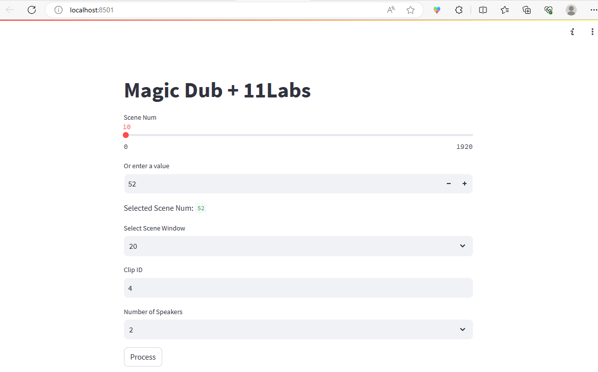
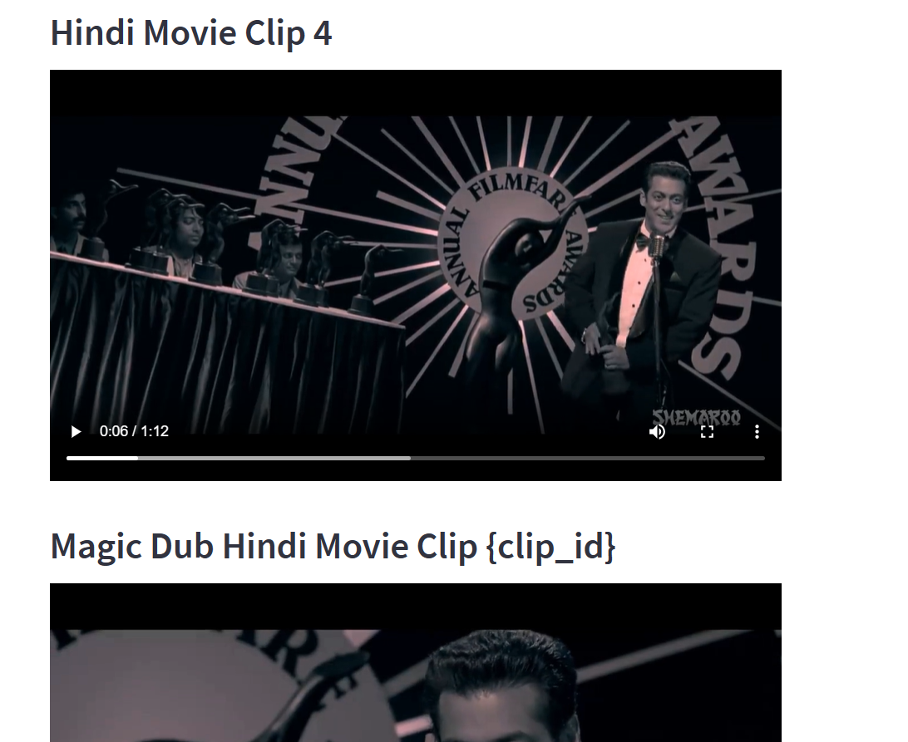

## Magic Dub + 11Labs 

The solution is part of the Hackathon hosted on lablab.ai by 11Labs.

The solution is a POC utility of TTS for translating a movie into English using provided subtitles and voice analytics, cloning, and TTS. 

The raw_file should contain 2 files - hindi_movie.mp4 and hindi_movie_eng_srt.srt. The movie is a Bollywood Romcom movie and is freely available on youtube, and still will be taken down if requested. The files are included in the drive link.
'''https://tinyurl.com/5zuc79b5'''

The project is built using conda-python3.10 and the environment is exported for reproducibility using ``conda env export > environment.yml``
or ```conda list --explicit > environment.txt```
You can use the project by installing anaconda/miniconda and then using terminal
    - ``` conda env create -f environment.yml```

Once the environment is set. You can launch the Streamlit app locally using the command 
    ``` streamlit run app.py ```

Next on the screen, currently, the tool is configured just for the movie in raw_files with accurate subtitles in English. Provided these, next the image below shows the Magic Dub Control. To prove the POC, the tool allows to select of any scene_num as starting scene with the selected scene window (num of next scene to include), Clip ID(Unique Number), Num of Speaker(Currently we need to specify:/)


And post this just hit Process and voila!! Magic Dub



